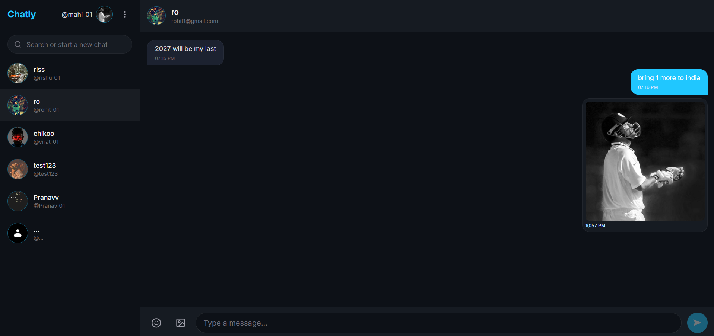
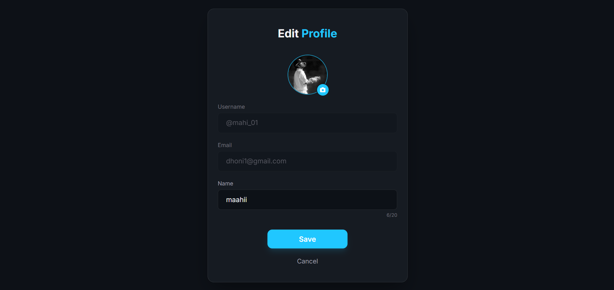

Chatly is a full-stack real-time chat application built using the MERN stack with Socket.IO for real-time communication.

It provides a modern and responsive messaging experience with secure authentication, real-time messaging, profile management, media uploads, and Google authentication.

## 🚀 Live Demo

https://chatly-app-six.vercel.app/

## 📂 GitHub Repository

https://github.com/scaryrishu/chatly-app

---

## ✨ Features

### 🔐 Authentication & Authorization

- User registration and login
- Secure password hashing using bcrypt
- JWT-based authentication
- Cookie-based authentication
- Protected routes
- Google authentication
- Change password functionality

### 💬 Real-Time Messaging

- One-to-one real-time conversations
- Instant message delivery using Socket.IO
- Persistent chat history
- Send and receive messages without refreshing the page
- Real-time synchronization between users

### 👤 User Management

- User profile management
- Update profile information
- Profile picture upload
- Search users
- Online/offline user status

### 🖼️ Media Support

- Profile image upload
- Cloud-based image storage using Cloudinary
- File handling using Multer

### 🎨 Modern UI

- Responsive chat interface
- Clean and modern design
- Toast notifications
- Emoji picker
- React Icons and Lucide React icons
- Authentication-aware UI

### ⚡ State Management

- Redux Toolkit
- React Redux
- Redux Persist
- Zustand

---

## 🛠️ Tech Stack

### Frontend

- React 19
- Vite
- React Router
- Redux Toolkit
- Redux Persist
- Zustand
- Axios
- Socket.IO Client
- Tailwind CSS
- React Hot Toast
- Emoji Picker React
- Lucide React
- React Icons

### Backend

- Node.js
- Express.js
- MongoDB
- Mongoose
- Socket.IO
- JWT
- bcryptjs
- Cloudinary
- Multer
- Cookie Parser
- CORS
- Google Auth Library
- dotenv

---

## 🏗️ Project Structure

```text
chatly-app/
│
├── backend/
│   ├── config/
│   │   ├── cloudinary.js
│   │   ├── db.js
│   │   └── token.js
│   │
│   ├── controlers/
│   │   ├── auth.controlers.js
│   │   ├── message.controllers.js
│   │   └── user.controllers.js
│   │
│   ├── middlewares/
│   │
│   ├── models/
│   │   ├── message.model.js
│   │   └── user.model.js
│   │
│   ├── routes/
│   │   ├── auth.routes.js
│   │   ├── message.routes.js
│   │   └── user.routes.js
│   │
│   ├── socket.js
│   ├── index.js
│   ├── cleanupOrphanedMessages.js
│   └── package.json
│
├── frontend/
│   ├── public/
│   │
│   ├── src/
│   │   ├── components/
│   │   ├── pages/
│   │   ├── customHooks/
│   │   └── ...
│   │
│   ├── package.json
│   ├── vite.config.js
│   ├── tailwind.config.js
│   └── postcss.config.js
│
└── README.md

```

## 🔄 Application Architecture

```text
                    ┌─────────────────────┐
                    │      Chatly UI      │
                    │    React + Vite     │
                    └──────────┬──────────┘
                               │
                      REST API + Socket.IO
                               │
                               ▼
                    ┌─────────────────────┐
                    │   Express Backend   │
                    │      Node.js        │
                    └──────────┬──────────┘
                               │
                ┌──────────────┼──────────────┐
                │              │              │
                ▼              ▼              ▼
           ┌─────────┐   ┌───────────┐   ┌───────────┐
           │ MongoDB │   │ Socket.IO │   │ Cloudinary│
           │ Database│   │ Real-Time │   │   Media   │
           └─────────┘   └───────────┘   └───────────┘
```

---

## 🚀 Getting Started

### 1. Clone the Repository

```bash
git clone https://github.com/scaryrishu/chatly-app.git
cd chatly-app
```

### 2. Install Backend Dependencies

```bash
cd backend
npm install
```

### 3. Configure Backend Environment Variables

Create a `.env` file inside the `backend` folder.

```env
PORT=5000
MONGODB_URL=your_mongodb_connection_string
JWT_SECRET=your_jwt_secret
CLIENT_URL=http://localhost:5173

CLOUDINARY_CLOUD_NAME=your_cloudinary_cloud_name
CLOUDINARY_API_KEY=your_cloudinary_api_key
CLOUDINARY_API_SECRET=your_cloudinary_api_secret

GOOGLE_CLIENT_ID=your_google_client_id
```

> Never commit your `.env` file or expose your API keys and secrets publicly.

### 4. Start the Backend

For development:

```bash
npm run dev
```

For production:

```bash
npm start
```

### 5. Install Frontend Dependencies

Open another terminal:

```bash
cd frontend
npm install
```

### 6. Configure Frontend Environment Variables

Create the required environment configuration inside the `frontend` folder.

Example:

```env
VITE_API_URL=http://localhost:5000
```

### 7. Start the Frontend

```bash
npm run dev
```

---

## 🔑 Authentication Flow

Chatly uses JWT-based authentication with cookie-based session handling.

```text
User
 │
 ▼
Login / Signup
 │
 ▼
Express API
 │
 ├── bcrypt → Password Verification
 │
 ├── JWT → Authentication
 │
 └── Cookie → Session Handling
 │
 ▼
Protected API Routes
```

---

## ⚡ Real-Time Messaging

Chatly uses Socket.IO for real-time communication.

```text
User A
   │
   │ Send Message
   ▼
Socket.IO Server
   │
   │ Real-Time Event
   ▼
User B
   │
   ▼
Message Appears Instantly
```

---

## 🗄️ Database

Chatly uses MongoDB with Mongoose.

Main data models include:

```text
User
 ├── name
 ├── email
 ├── password
 ├── profileImage
 └── ...

Message
 ├── sender
 ├── receiver
 ├── message
 ├── timestamp
 └── ...
```

---

## ☁️ Media Uploads

Chatly uses Cloudinary for cloud-based media storage.

```text
User
  │
  ▼
Frontend
  │
  ▼
Multer
  │
  ▼
Backend
  │
  ▼
Cloudinary
  │
  ▼
Cloud URL
  │
  ▼
MongoDB / User Profile
```

---

## 📡 API Structure

The backend organizes APIs into three major route groups:

```text
/api/auth
/api/user
/api/message
```

### Authentication

`/api/auth/*`

Handles user authentication and account-related operations.

### Users

`/api/user/*`

Handles user-related operations and profile management.

### Messages

`/api/message/*`

Handles message-related operations.

---

## 📸 Screenshots

### Login


### Chat



### Profile


```

---

## 🧠 What I Learned

Building Chatly helped me understand and implement:

- Full-stack MERN application architecture
- REST API development
- JWT authentication
- Cookie-based authentication
- Password hashing
- Google authentication
- MongoDB data modeling with Mongoose
- Real-time communication with Socket.IO
- File uploads with Multer
- Cloudinary integration
- React Router protected routes
- Redux Toolkit state management
- Zustand
- Persistent client-side state
- Frontend-backend integration
- CORS configuration
- Environment variable management
- Full-stack deployment

---

## 🔮 Future Improvements

- [ ] Group chats
- [ ] Message reactions
- [ ] Message editing and deletion
- [ ] Typing indicators
- [ ] Read receipts
- [ ] Voice messages
- [ ] Video calling
- [ ] Message search
- [ ] Push notifications
- [ ] Dark/light theme
- [ ] Message encryption
- [ ] Improved mobile experience

---

## 🤝 Contributing

Contributions are welcome!

1. Fork the repository
2. Create a new branch

```bash
git checkout -b feature/your-feature
```

3. Make your changes
4. Commit your changes

```bash
git commit -m "Add your feature"
```

5. Push the branch

```bash
git push origin feature/your-feature
```

6. Open a Pull Request

---

## 📄 License

This project is currently available for learning and personal use.

---

## 👨‍💻 Author

**Rishu Singh**

GitHub: https://github.com/scaryrishu

---

## ⭐ Show Your Support

If you found this project useful or interesting, consider giving the repository a star on GitHub.

**Built with ❤️ using the MERN Stack + Socket.IO**
